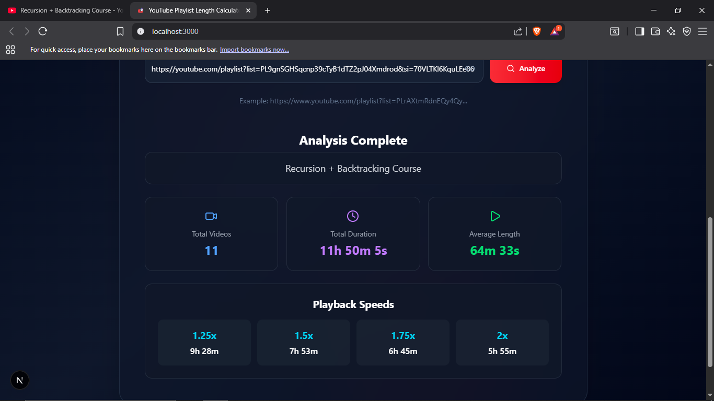
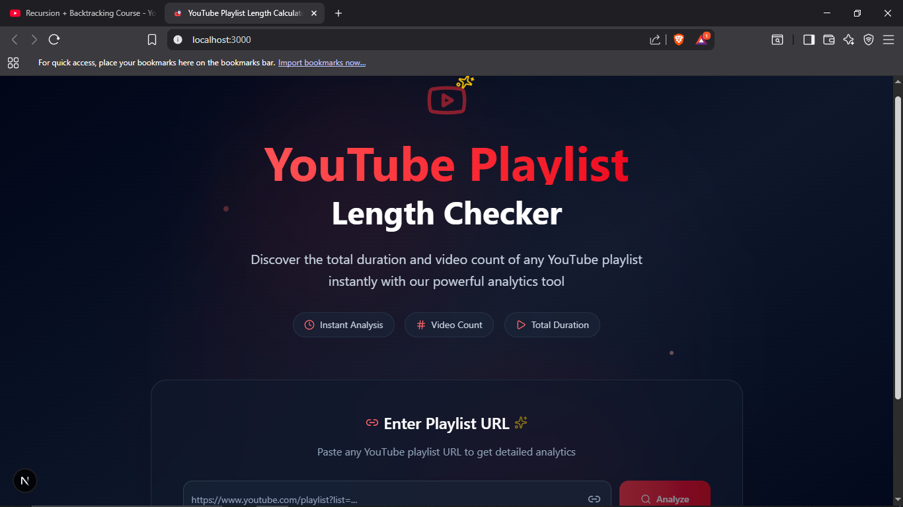

# 🎵 YouTube Playlist Length Checker

<div align="center">
  

**🚀 [Live Demo](#) 🚀**

</div>

A simple tool to analyze YouTube playlists, showing total duration, number of videos, and estimated completion times at different playback speeds.

## ✨ Features

* ⏱️ **Total Duration** - Calculate the full length of any YouTube playlist
* 🎬 **Video Count** - Know the total number of videos in a playlist
* ⚡ **Playback Estimates** - See when the playlist will finish at 1.25x, 1.5x, 1.75x, and 2x speeds
* 🚀 **Instant Analysis** - Fetch data directly from YouTube using API key
* 🎨 **Clean UI** - Modern and responsive design with Tailwind CSS

## 🚀 Quick Start

1. **Clone & Install**

   ```bash
   git clone https://github.com/piyush15975/yt-playlist-length-checker.git
   cd yt-playlist-length-checker
   npm install
   ```

2. **Environment Setup**

   ```bash
   # Create .env.local in the root directory
   YOUTUBE_API_KEY=your-youtube-api-key
   ```

3. **Run Development Server**

   ```bash
   npm run dev
   ```

4. **Open** [http://localhost:3000](http://localhost:3000)

## 📸 Screenshots

### Main Interface



### Results & Playback Estimates

<div align="center">
  
  <br>
  <em>Example showing total duration, video count, and estimated playback times</em>
</div>

## 🛠️ Tech Stack

* **Next.js 15** - React framework
* **Tailwind CSS** - Styling
* **YouTube Data API v3** - Fetch playlist information
* **TypeScript** - Type safety

## 🌟 How It Works

1. Enter a YouTube playlist URL
2. Click **Analyze Playlist**
3. View results including total duration, number of videos, and estimated finish times at different speeds

---

**Built with ❤️ using Next.js and YouTube API**
